  

  

  
  &nbsp;
  

 

### Hey, I’m Iqra 👋

I’m a **data analyst and product-minded developer** who enjoys finding the story in messy data—and building experiences people actually want to use. My work sits at the intersection of **business intelligence, software, and fashion-tech**.

> **My kind of workflow:** understand the question → shape the data → find the signal → make the insight useful.

---

### ✦ A few things I’ve made

<table>
  <tr>
    <td width="50%" valign="top">
      <strong>01 / BUSINESS INTELLIGENCE</strong> 
      <h3>🥇 The Beauty of Analysis</h3>
      
An award-winning Nykaa e-commerce analytics project: 5,000 transactions explored across customers, products, discounts, returns, and profitability—turned into an interactive Excel dashboard and business recommendations.

      
<a href="https://github.com/iqrakoradia/nykaa-ecommerce-sales-analytics">Explore the project ↗</a>

    </td>
    <td width="50%" valign="top">
      <strong>02 / FASHION × AI</strong> 
      <h3>👗 VogueVision</h3>
      
An AI-powered fashion assistant concept bringing together virtual try-on, makeup shade matching, outfit discovery, and personalized style inspiration.

      
<a href="https://github.com/iqrakoradia/VogueVision">Explore the project ↗</a>

    </td>
  </tr>
  <tr>
    <td width="50%" valign="top">
      <strong>03 / CUSTOMER ANALYTICS</strong> 
      <h3>◉ E-commerce Segmentation</h3>
      
RFM analysis and K-Means clustering to explore customer groups, behavior, and revenue opportunities—with an interactive dashboard.

      
<a href="https://github.com/iqrakoradia/Ecommerce-customer-segmentation">Explore the project ↗</a>

    </td>
    <td width="50%" valign="top">
      <strong>04 / FINANCIAL ANALYTICS</strong> 
      <h3>↗ Indian Company Analytics</h3>
      
An interactive look at company financial performance and risk, built to make complex business signals easier to explore.

      
<a href="https://github.com/iqrakoradia/indian-company-financial-analytics">Explore the project ↗</a>

    </td>
  </tr>
</table>

---

  <h3>↗ GitHub at a glance</h3>
  
  
   
  Live cards from public repositories · powered by <a href="https://github.com/stats-organization/github-stats-extended">GitHub Stats Extended</a>

---

### ✧ My toolkit

**Analytics & BI**　`Excel` `SQL` `Python` `Pandas` `Power BI` `Tableau` `EDA` `KPI reporting` 
**Build & visualize**　`JavaScript` `React` `Node.js` `MongoDB` `REST APIs` `Matplotlib` 
**Explore**　`Customer analytics` `Business intelligence` `Product strategy` `Computer vision`

### ✦ A little about me

- 🏆 **1st place** — Data Analytics Capstone Competition, for *The Beauty of Analysis*.
- 🎓 **B.Voc in Software Development**, Jai Hind College — **9.69 / 10 CGPA**.
- 🧩 I like connecting the dots between **what the numbers say** and **what a team can do next**.
- 🛠️ Background across software development, product planning, and business analysis.

---

  
   
  Thanks for stopping by. Have a project where data meets a real-world problem? <a href="https://github.com/iqrakoradia">Let’s connect on GitHub ↗</a>

